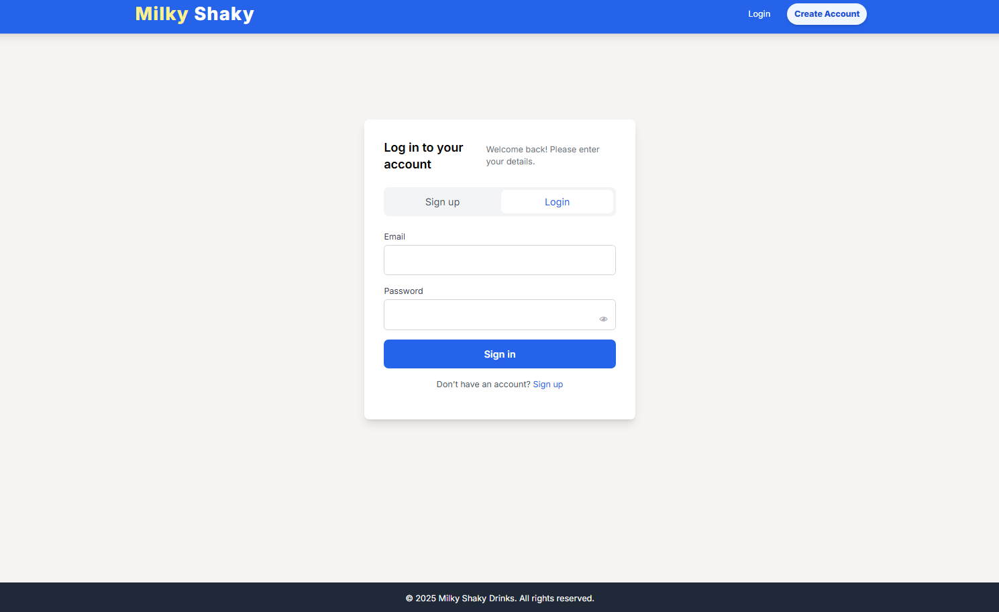
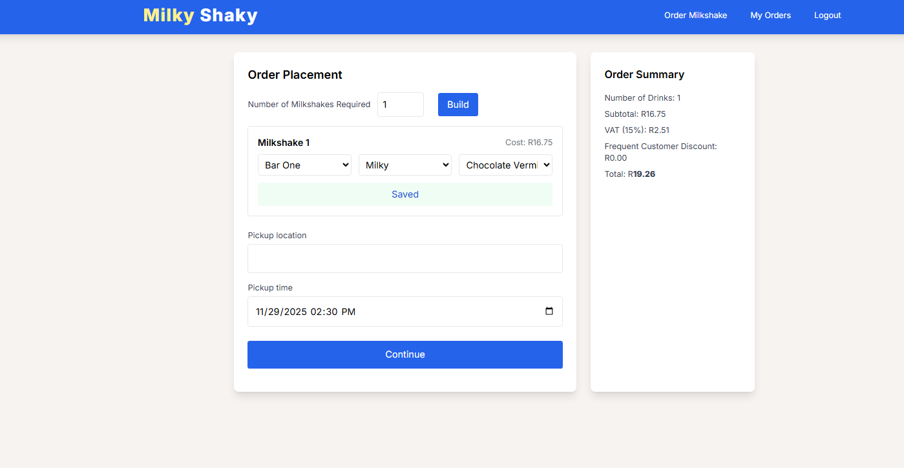
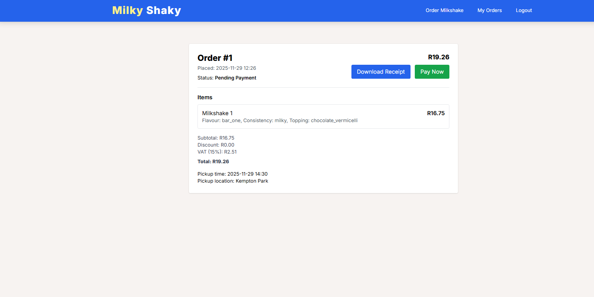
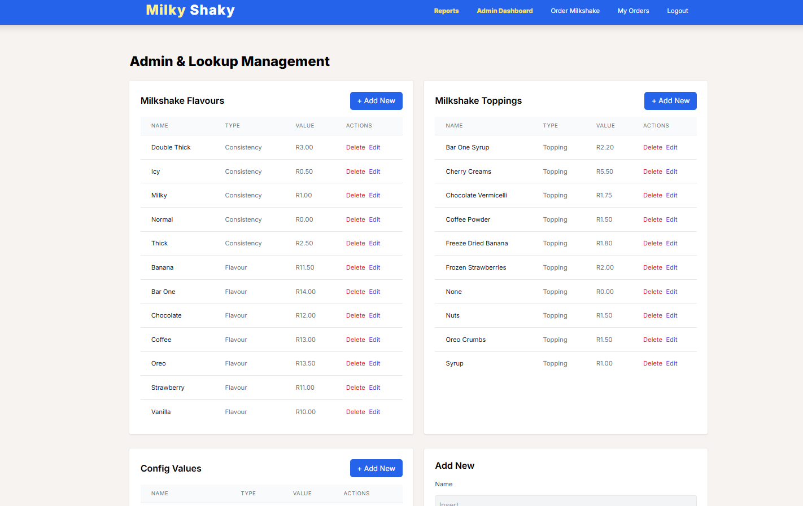
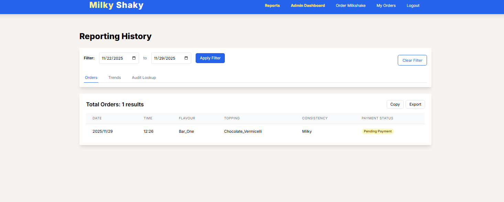
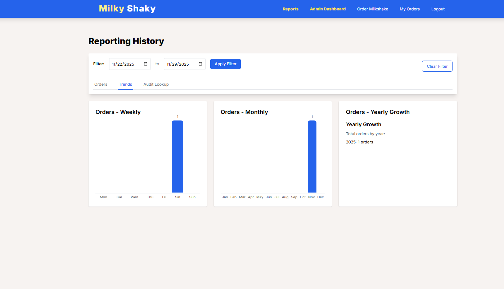
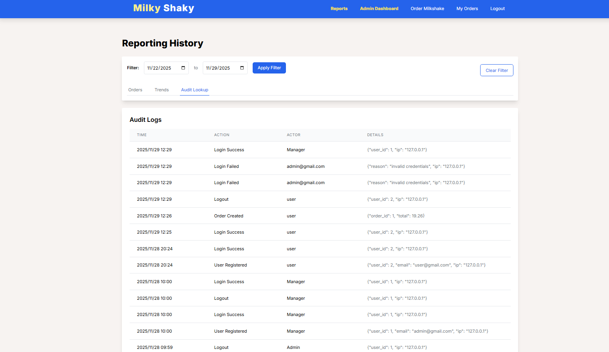

# Milky Shaky Drinks E-Commerce Platform

## 🥤 Project Overview

Milky Shaky Drinks is a Flask-based web application designed to manage custom milkshake orders, from user registration and dynamic order placement to payment processing and administrative reporting. It utilizes an SQL database (SQLite in development) for persistent storage and incorporates modern features like role-based access control (RBAC) and dynamic lookup management.

## Technology Stack

| Component        | Technology / Implementation     | Notes                                                                 |
|------------------|----------------------------------|-----------------------------------------------------------------------|
| **Backend**       | Flask, Python 3                  | Main application logic and routing.                                   |
| **Database**      | SQLite3 / Flask-SQLAlchemy       | Used for persistent data storage in development.                      |
| **Authentication**| Flask-Login, Flask-Bcrypt        | Secure user sessions and password hashing.                            |
| **Styling**       | Tailwind CSS (CDN)               | Used for all frontend design and responsiveness.                      |
| **Payment Gateway** | Payments (Simulated)     | Hosted Checkout flow implemented via a POST redirect.                 |
| **Async Tasks**   | Python `threading`               | Sends emails in the background to prevent blocking web requests.      |

##  Application Preview (Screenshots)

Below are short video snippets demonstrating the application's core functionality, following a typical user journey.

---

### 1. User Registration and Login


---

### 2. Dynamic Order Placement


---
### 3. Payment Flow & Confirmation

---

### 4. Admin Lookup Management (Manager View)
<table>
  <tr>
    <td></td>
    <td></td>
  </tr>
  <tr>
    <td></td>
    <td></td>
  </tr>
</table>

---

## Installation
Instructions for setting up the project locally.


---

#### 1. Clone the repository

```bash
git clone https://github.com/BKGitRepo/milky_shaky_web_application.git
cd your-repo
```
#### 2. Create and activate a virtual environment
```bash
python3 -m venv venv
source venv/bin/activate      # macOS / Linux
venv\Scripts\activate         # Windows
```
#### 3. Install the required dependencies
```bash
pip install -r requirements.txt
```
#### 4. Start the development server
```bash
flask run
```
#### 5. Admin Login Credentials
      -Email: admin@gmail.com
      -Password: manager@1234
These credentials unlock the Manager Panel where lookup tables and system configurations can be managed.
